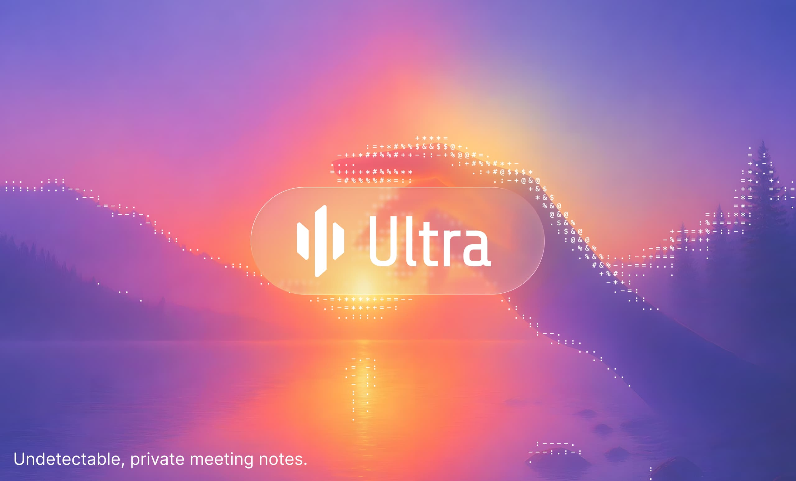

# Ultra



Privacy-first AI meeting notes for macOS. Records meetings, transcribes them locally, labels speakers on device, and generates AI notes — all on your machine.

Website: [ultra.ashref.tn](https://ultra.ashref.tn)

---

## What Ultra does

- **Records meetings** from your microphone and system audio simultaneously with automatic ducking.
- **Transcribes in real time** with local Whisper, Parakeet, or Qwen3 ASR models — raw audio never leaves your machine.
- **Labels speakers automatically** after each recording with on-device pyannote + WeSpeaker ONNX diarization.
- **Summarizes with AI** using your choice of provider: local Ollama, OpenAI, Claude, Groq, OpenRouter, or any OpenAI-compatible endpoint.
- **Searches across all meetings** with full-text transcript indexing.
- **Imports existing audio** in MP3, WAV, FLAC, OGG, MP4, MKV, WebM, or WMA format.
- **Provides menubar quick access** with one-click recording start/stop. The tray icon turns red while recording.

---

## Privacy

Ultra is built on the principle that meeting data is sensitive and should stay on your device.

- Audio and transcripts never touch a third-party server (unless you explicitly choose a cloud AI provider for summaries).
- Transcription and diarization run on device with Metal GPU acceleration on Apple Silicon.
- No telemetry. No analytics. No login. No account required.
- Recordings live in `~/Movies/ultra-meet-recordings/` by default. The database lives under `~/Library/Application Support/tn.ashref.ultrameet/`.

See the full [Privacy Policy](PRIVACY_POLICY.md).

---

## Installation

Download the latest `.dmg` from the [releases page](https://github.com/Ashref-dev/ultra-meet-notes/releases).

1. Open the `.dmg`
2. Drag `Ultra Meet.app` to your Applications folder
3. Launch from Applications — macOS will prompt once for microphone and screen recording access.

### Build from source

Prerequisites: Rust (stable), Node.js 18+, pnpm, Xcode command-line tools, ffmpeg via Homebrew.

```bash
git clone https://github.com/Ashref-dev/ultra-meet-notes
cd ultra-meet-notes/frontend
pnpm install
pnpm run tauri build
```

Output: `target/release/bundle/macos/Ultra Meet.app` and `target/release/bundle/dmg/Ultra Meet_<version>_aarch64.dmg`.

---

## AI providers

Ultra does not hard-code a single provider. Configure your preferred model in Settings.

| Provider                | Where models run      | API key required |
| ----------------------- | --------------------- | ---------------- |
| Built-in (llama-helper) | On-device, bundled    | No               |
| Ollama                  | On-device, your setup | No               |
| OpenAI                  | Cloud                 | Yes              |
| Claude                  | Cloud                 | Yes              |
| Groq                    | Cloud                 | Yes              |
| OpenRouter              | Cloud, any model      | Yes              |
| Custom endpoint         | Any OpenAI-compatible | Optional         |

The recommended default is Ollama with a small local model such as `qwen2.5:3b` or `llama3.2:3b` for fully local summaries at zero API cost.

---

## Architecture

Ultra is a single Tauri 2 application with a Rust backend and a Next.js 14 frontend. There is no separate server process.

```
frontend/
  src/                Next.js UI (React 18, Tailwind, BlockNote editor)
  src-tauri/          Rust backend (audio capture, Whisper FFI, Pyannote, storage)
  whisper-server-package/
                      Prebuilt Whisper binary used by the Rust audio pipeline
  public/             Static assets
```

- **Audio capture**: CoreAudio tap on macOS for system audio, plus AVAudioEngine for microphone input. Mixed in Rust with clipping prevention.
- **Transcription**: `whisper-rs` with Metal acceleration. Streaming transcripts delivered through Tauri events.
- **Diarization**: ONNX Pyannote embedding model, clustered in process.
- **Summarization**: Pluggable provider abstraction in `src-tauri/src/summary/`. Each provider implements a common `Summarizer` trait.

---

## Development

```bash
cd frontend
pnpm install
pnpm run tauri:dev          # dev server + Tauri window, hot reload
pnpm run lint               # ESLint
pnpm run typecheck          # tsc --noEmit
pnpm run tauri:build        # release .app + .dmg
```

Frontend dev server: `http://localhost:3118`.

### Contributing

Pull requests are welcome. Keep the scope tight and the commit history linear. Every PR should:

- Leave `pnpm typecheck` clean.
- Match the existing visual system. See `DESIGN.md` and the Tailwind config.
- Include a one-line changelog entry in the PR description.

---

## Acknowledgements

Ultra is a fork of the open-source [Meetily](https://github.com/Zackriya-Solutions/meeting-minutes) project (MIT, Zackriya Solutions). Ultra is an independent rebrand with substantial changes to UI, audio pipeline, AI provider layer, and packaging. The original MIT license is preserved.

---

## License

MIT. See [`LICENSE.md`](LICENSE.md).

---

## Changelog

### v2.1.0
- Brand consistency polish: replaced system blue accent with brand purple across all UI primitives
- Fixed tab gradient, wordmark sizing, About page double scrollbar, and duplicate Language button
- Full changelog in the [release notes](https://github.com/Ashref-dev/ultra-meet-notes/releases/tag/v2.1.0)

### v2.0.0
- Complete brand refresh to Ultra identity with new logo, color palette, and typography
- New DESIGN.md documenting the complete visual system

### v1.0.5
- Rebranded across the entire application
- Fixed app launch on macOS 26 and DMG build pipeline

### v1.0.4
- macOS release packaging and code signing improvements

### v1.0.3
- Language settings accessible everywhere, sidebar improvements, auto-summary race condition fix

---

Made by [Ashref](https://ashref.tn).
