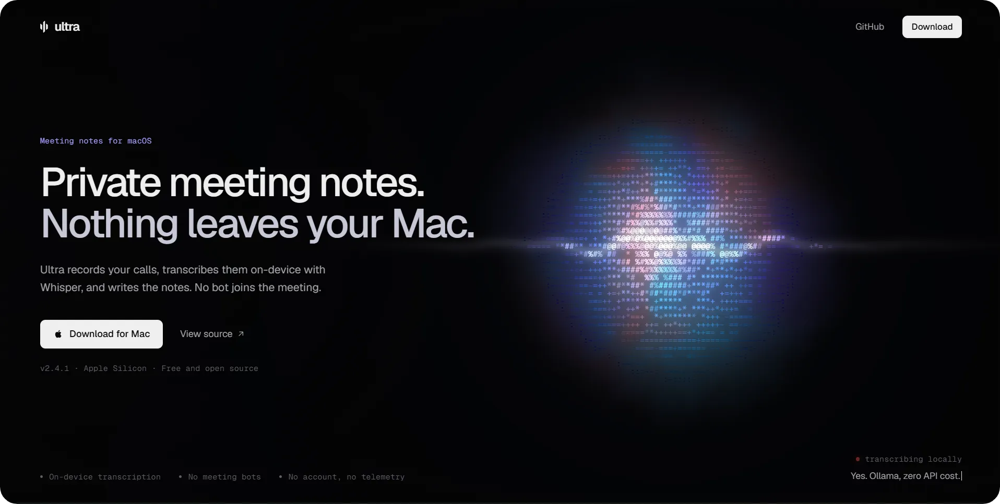

# Ultra



Privacy-first AI meeting notes for macOS. Records meetings, transcribes locally with Whisper, and writes notes. All on device.

Website: [ultra.achraf.tn](https://ultra.achraf.tn)

## Features

- Record mic and system audio with auto ducking
- Local transcription with Whisper, Parakeet, or Qwen3 ASR
- Summarize with Ollama, OpenAI, Claude, Groq, OpenRouter, or any OpenAI compatible endpoint
- Full text search across meetings
- Import MP3, WAV, FLAC, OGG, MP4, MKV, WebM, WMA
- Menubar quick record with tray indicator

## Privacy

- Audio and transcripts stay on device by default
- Local transcription with Metal acceleration on Apple Silicon
- No telemetry, no analytics, no login
- Recordings in `~/Movies/ultra-meet-recordings/`. Data in `~/Library/Application Support/tn.ashref.ultrameet/`

See [Privacy Policy](PRIVACY_POLICY.md).

## Install

Download the latest `.dmg` from [releases](https://github.com/Ashref-dev/ultra-meet-notes/releases).

1. Open the `.dmg`
2. Drag `Ultra Meet.app` to Applications
3. Launch it and allow mic and screen recording once

### Build from source

Requires Rust stable, Node 18+, pnpm, Xcode CLI tools, ffmpeg.

```bash
git clone https://github.com/Ashref-dev/ultra-meet-notes
cd ultra-meet-notes/frontend
pnpm install
pnpm run tauri build
```

Output: `target/release/bundle/macos/Ultra Meet.app` and the `.dmg`.

## AI providers

| Provider | Runs | Key |
| --- | --- | --- |
| Built-in | On device | No |
| Ollama | On device | No |
| OpenAI | Cloud | Yes |
| Claude | Cloud | Yes |
| Groq | Cloud | Yes |
| OpenRouter | Cloud | Yes |
| Custom endpoint | OpenAI compatible | Optional |

Default is Ollama with `qwen2.5:3b` or `llama3.2:3b` for local summaries.

## Dev

```bash
cd frontend
pnpm install
pnpm run tauri:dev
pnpm run lint
pnpm run typecheck
pnpm run tauri:build
```

Dev server: `http://localhost:3118`.

## License

MIT. See [`LICENSE.md`](LICENSE.md).

Made by [Achraf](https://achraf.tn).
